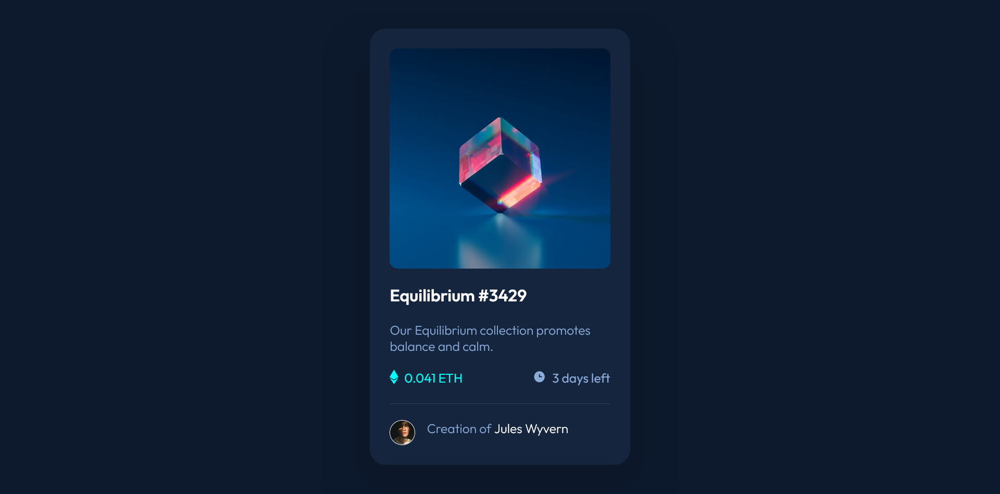

# Frontend Mentor - nft-preview-card-component-main-7_20

This is a solution to the [NFT preview card component challenge on Frontend Mentor](https://www.frontendmentor.io/challenges/nft-preview-card-component-SbdUL_w0U). Frontend Mentor challenges help you improve your coding skills by building realistic projects. 
## Table of contents

- [Overview](#overview)
  - [Screenshot](#screenshot)
  - [Links](#links)
- [My process](#my-process)
  - [Built with](#built-with)
  - [What I learned](#what-i-learned)
  - [Continued development](#continued-development)
- [Author](#author)
- [Acknowledgments](#acknowledgments)

## Overview

### Screenshot

<!--  -->

### Links

- Solution URL: [Link to my solution git repo](https://github.com/breeMudi/nft-preview-card-component-main-7_20/tree/main)
- Live Site URL: [Link to project view on git-hub live server](https://breemudi.github.io/nft-preview-card-component-main-7_20/)

## My process

This project was carried out with a mobile-first approach. 

Exercise source: frontend Mentor website 

Both the mobile and desktop view are similar

### Built with

- Semantic HTML5 markup
- CSS custom properties
- Flexbox
- Mobile-first workflow
- [Styled Components](https://styled-components.com/) - For styles

### What I learned

### Continued development

As part of my 20-frontendMentor project challenge series, here is project 7 of 20 ... yaay!

## Author

- Frontend Mentor - [@breeMudi](https://www.frontendmentor.io/profile/breeMudi)
- Twitter - [@Bridgetmudiaga](https://www.twitter.com/Bridgetmudiaga)

## Acknowledgments

Special thanks to Zach Goll (https://github.com/zachgoll/fullstack-roadmap-series) for his wonderful introduction to webdevelopment Bootcamp

